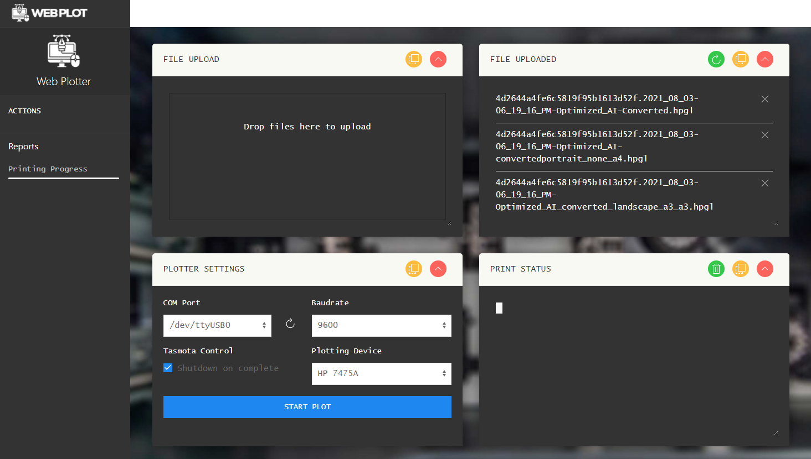

# WebPlot - A Web interface for Pen Plotters

Python webservice to simplify working with pen plotters:
- Supported plotters: Graphtec MP4200, HP7475a
- Created for Raspberry Pi.
- Upload *.SVG and *.HPGL files.
- Convert *.SVG into *.HPGL files using [vpype](https://github.com/abey79/vpype)
- Telegram notification on print end
- Poweroff your plotter on print end using a Tasmota-enabled Sonoff controller

[](https://github.com/henrytriplette/penplotter-webserver)

## Installation

An install script is included.
From the home directory, run:

```bash
curl -O https://raw.githubusercontent.com/henrytriplette/penplotter-webserver/main/install.sh
chmod +x install.sh
```

Then run it:
```bash
./install.sh
```
Raspberry Pi will reboot once installation is completed.

## Usage

After install, open a browser and reach for:
```bash
http://{{your Raspberry Pi address}}:5000
```

Optional:
Configure options in *config.ini* using the web interface to set:
- Tasmota device IP.
- Telegram Chat ID for notifications.

## ToDO

- [x] Fix Mobile UI
- [x] Add plotter name to toolbar
- [x] Add defaults to configuration file
- [x] Stop print via UI?
- [x] List current printing filename

- [ ] More plotter options?

## Contributing
Pull requests are welcome. For major changes, please open an issue first to discuss what you would like to change.

## License
[MIT](https://choosealicense.com/licenses/mit/)
